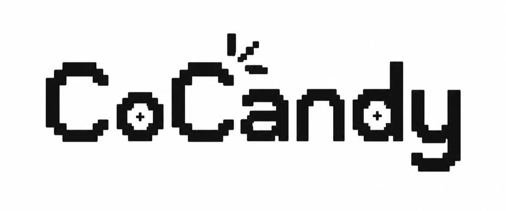

  
  

    

        
        
        
        
        
        
        
        
        
        
    

    

  

    
    
    
  

  

    
    
  

  

    
  

  

  <picture>
    <source media="(prefers-color-scheme: dark)" srcset="assets/garden-footer-night.svg" />
    
  </picture>

